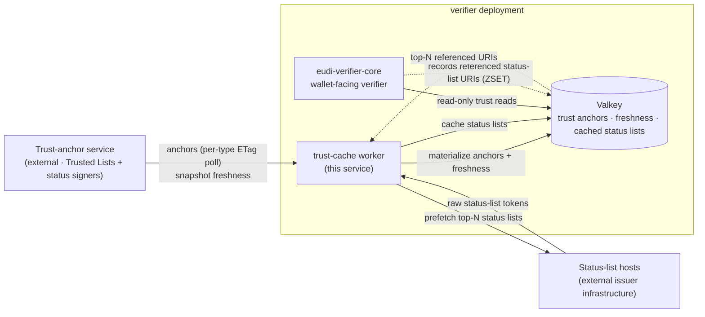
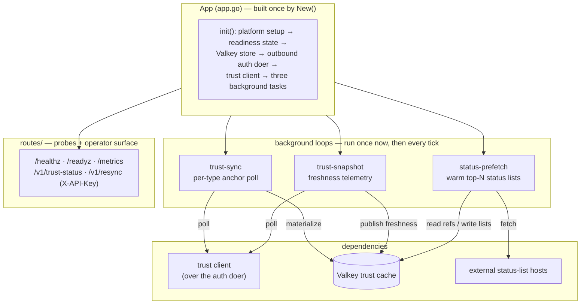
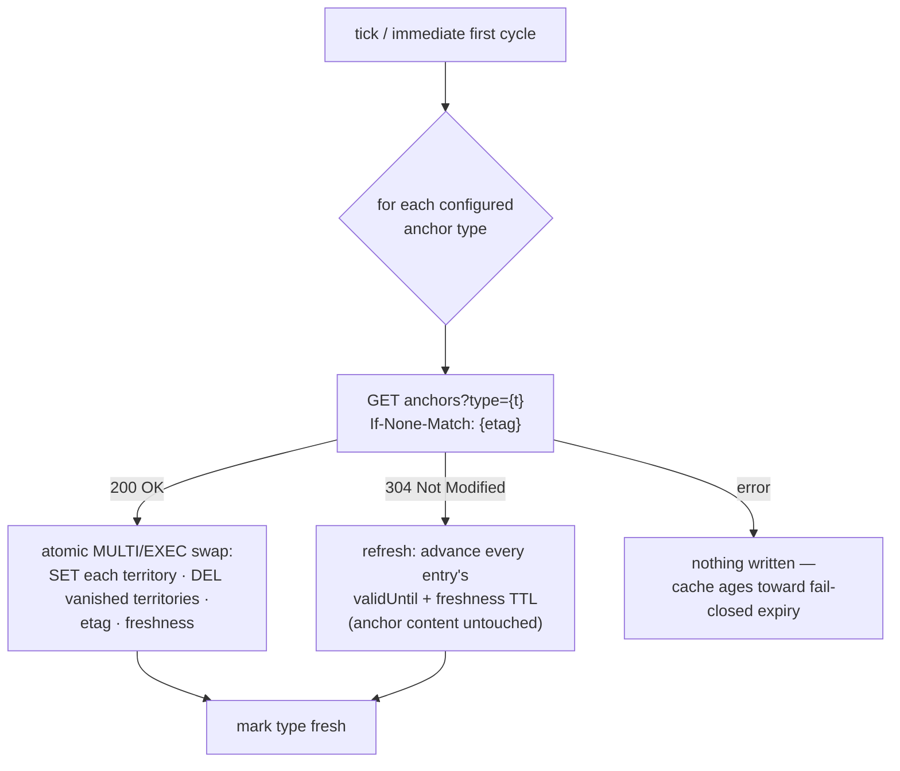
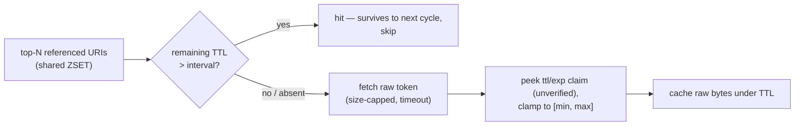
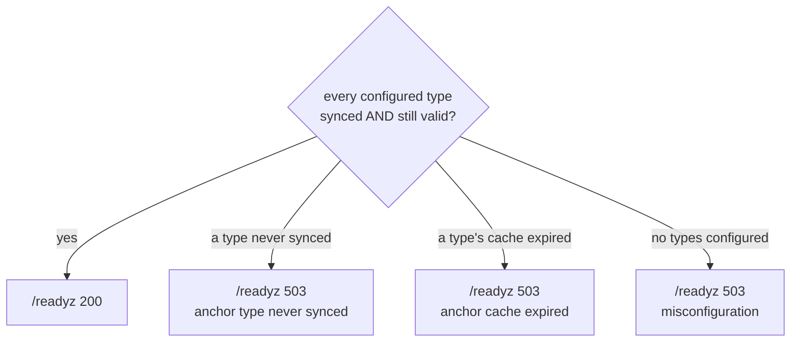

# trust-cache-worker

The **background** service of an EU Digital Identity Wallet **Relying Party (Verifier)** — it keeps the fleet-shared trust cache warm so the wallet-facing verifier never blocks on, or stampedes, the upstream trust-anchor service. It polls the trust-anchor service for **trust anchors** and **snapshot freshness**, refreshes hot **status lists** ahead of their expiry, and materializes all of it into one shared Valkey under a strict TTL contract. Every write carries a validity horizon; on any upstream failure it writes **nothing** and lets the cache age toward a fail-closed expiry rather than serving stale trust.

It has **no wallet- or tenant-facing HTTP surface** — no wallet endpoints, no tenant API, renders no UI. Its endpoints are the liveness/readiness probes, the metrics registry, and a small **key-gated operator surface** (trust identity + on-demand resync) that exists only when an admin key is configured. Everything else happens on three background loops that run once immediately at startup and then on a fixed cadence.

The worker is the **only** component that talks to the trust-anchor service. Consumers (the wallet-facing verifier) read the cache read-only and never fetch trust data themselves — so a single warm cache absorbs the whole fleet's trust reads, and trust-anchor withdrawal takes effect for everyone the moment the worker materializes a new snapshot (**ARF §6.6.3.6**: the snapshot is the authoritative anchor set).

---

## Where it sits

`trust-cache-worker` is one service in a small set, and the only one that reaches the trust-anchor service. It writes anchors, per-type freshness and cached status lists into a shared Valkey; the wallet-facing verifier reads those keys read-only and records which status-list URIs it actually referenced, which is the popularity signal the worker prefetches from.



Division of labour: the wallet-facing verifier owns every verification decision and reads trust data **only** from this cache — never the system cert pool, never inline PEM, never a direct trust-list fetch. The worker owns everything upstream of that cache: authenticating to the trust-anchor service, polling it, and writing the cache with a TTL that doubles as the fleet's failover budget. The two meet only at the shared Valkey key contract.

---

## HTTP surface

The worker exposes probes, metrics, and — only when `TRUST_ADMIN_KEY` is configured — a key-gated operator surface. There is no wallet- or tenant-facing API.

| Method + path | Auth | Purpose | Notes |
|---|---|---|---|
| `GET /healthz` | none | Liveness | 200 whenever the process is up; skipped in the access log |
| `GET /readyz` | none | Readiness (fail-closed) | 503 with the failing anchor type named until **every** configured type has been synced fresh and its cache is still valid |
| `GET /metrics` | none | Prometheus / VictoriaMetrics registry | Freshness gauges + sync/prefetch counters |
| `GET /v1/trust-status` | `X-API-Key` | Trust identity report | Per anchor type: the snapshot id held, fetched-at, valid-until, upstream-stale — so an operator can confirm a trust change actually propagated to this hop |
| `POST /v1/resync` | `X-API-Key` | Sync **now** | Runs one sync cycle (or joins the one in flight) and answers with the same identity report; 503 + the report when the cache is still not fully fresh after the cycle. The operator's cure for a stale cache — no container restart |

**The operator surface fails closed to nonexistent.** With no `TRUST_ADMIN_KEY` configured the `/v1` routes are not bound at all (404), never served unauthenticated. The key is compared constant-time (both sides hashed first), uses the same `X-API-Key` header shape as the trust service's own admin endpoints — one runbook for both hops: *refresh top-down, compare snapshot ids* — and never appears in logs, events, or error messages.

The container `HEALTHCHECK` uses a local `health` subcommand (an in-process `/healthz` probe), not a network port.

---

## Architecture

One application object (`App` in `app.go`) wires every dependency at startup and **fails closed** on misconfiguration — a bad Valkey URL, an invalid auth mode, or an unknown anchor-type name in the configuration stops the process from starting. The composed libraries are framework-free `go-eudi-*` modules; the worker owns only the wiring and the three loops.



Each loop is a self-scheduling task that runs its job immediately on start (a fresh pod warms the cache now, not one interval later), then on every tick, minting a fresh correlation id per cycle so a cycle's outbound calls and log lines join up. A per-cycle job failure is logged and counted, never fatal — one broken anchor type must not starve the others' freshness.

---

## The anchor sync loop

`internal/trustsync` polls the trust-anchor service **per type** with a strong `ETag` (`If-None-Match`) and materializes the result atomically. Anchors are grouped **by territory** — the granularity the verifier reads at (`anchors for (type, country)`).



- **200** — an atomic per-type replacement in one `MULTI`/`EXEC`: every current territory is written and any territory that disappeared from the snapshot is deleted in the same transaction, so a reader observes strictly before- or strictly after-swap state (**ARF §6.6.3.6**: anchor withdrawal takes effect on snapshot replacement).
- **304** — the content is untouched, but the cache-validity horizon is advanced exactly as a 200 does: a 304 is upstream's explicit confirmation the snapshot is still current, so every entry's embedded `validUntil` and the per-type freshness are pushed to the same new horizon. Leaving them frozen while only extending the raw key TTL would let a consumer's embedded-`validUntil` check trip on a perfectly healthy, successfully polling worker.
- **error** — nothing is written; the cache ages toward its TTL and consumers see the degradation.

### Cache TTL is the failover budget

The materialized-anchor TTL (`TRUST_CACHE_TTL`, default 45m) is the window the verifier may keep serving from a **dead** worker before failing closed — nine missed polls at the default 5m cadence. It **must exceed** the poll interval (enforced at config validation); otherwise a healthy, successfully polling worker would let its own cache expire between cycles.

### One cycle at a time

The scheduled poll and the operator's `POST /v1/resync` share one guarded entry: a caller arriving while a cycle is in flight **joins** that cycle — waits for it and returns its result state — rather than starting a concurrent second one whose per-type swaps would interleave with the first's.

---

## Snapshot freshness telemetry

`internal/telemetry` polls the trust-anchor service's snapshot endpoint and publishes a compact health record to the cache plus operator gauges. It carries the **LOTL sequence** (List of Trusted Lists), per-territory staleness, an aggregate upstream-stale flag, and a **pending-bootstrap** alert.

- The aggregate **upstream-stale** signal is the OR of every territory's stale flag — any stale territory degrades the snapshot as a whole (conservative: surface degradation rather than hide it).
- **Pending bootstrap** means the trust-anchor service has staged a new LOTL signer set that awaits **manual** operator approval and never auto-activates. It is surfaced both as a gauge (`trust_cache_pending_bootstrap=1`) and a `Warn` log line for alert routing.
- On a poll failure nothing is written: the previously published record ages toward its TTL and consumers see the degradation (fail-closed).

An untrusted sequence number from upstream JSON is clamped to `0` ("unknown") rather than allowed to wrap to an implausibly large value.

---

## Status-list prefetch

`internal/prefetch` keeps the **top-N** most recently referenced status lists warm so the verifier's revocation checks (**ARF §6.6.3.7**) hit a warm cache instead of stalling on the issuer's status endpoint. The reference popularity comes from a shared ZSET the verifier writes on every status resolution.



The TTL peek reads the `ttl` claim (capped by `exp`) from a JWT-form status-list token **without verifying it** — the value only bounds how long the raw bytes stay cached; the verifier fetches, verifies and applies authoritative TTL semantics at check time. Non-JWT input (including the CWT/CBOR form) falls back to the default TTL. The claimed TTL is clamped to `[min, max]` so an attacker-controlled claim can neither pin garbage forever nor thrash the cache. Per-URI failures are counted and logged, never abort the pass; raw issuer URIs are **hashed** in every key and log line so they never appear in the keyspace or logs.

The parser is fuzzed (`FuzzPeekTTL`) and must never panic on malformed input.

---

## Trust and fail-closed behaviour

Readiness is the worker's contract with the rest of the fleet: it is **ready only when it is actively maintaining a live cache for every configured anchor type**.



**Startup contract.** The worker probes the trust-anchor service once before it starts serving. If the service is unreachable, startup is **fatal** — the pod restarts — unless `--allow-cold-start` is set, in which case the worker boots **degraded** and `/readyz` stays 503 until the first successful sync. Either way it never reports ready without a live cache.

**Config is fail-closed too.** An unknown anchor-type name, a cache TTL that does not exceed the poll interval, or a missing required setting fails validation at boot rather than silently dropping a type or expiring the cache mid-cycle.

---

## Anchor-type taxonomy

The worker syncs a fixed taxonomy of anchor types; the configured set defaults to all of them, and an unknown name in the configuration is a boot-time error. Each provider/CA/registrar type may have a distinct status-signer type, because the status-list signer can be a different service from the credential issuer.

| Type | Role |
|---|---|
| `pid_provider` | PID issuer anchors |
| `qeaa_provider` | QEAA issuer anchors |
| `pub_eaa_provider` | Public-body EAA issuer anchors |
| `eaa_provider` | (Q)EAA issuer anchors |
| `wallet_provider` | Wallet-provider anchors |
| `access_ca` | Access-certificate CA anchors |
| `wrprc_issuer` | Relying-party registration-certificate issuer anchors |
| `pid_provider_status` · `qeaa_provider_status` · `pub_eaa_provider_status` · `eaa_provider_status` | Status-signer anchors per issuer class |

Territories are ISO 3166-1 alpha-2 codes; EU-level (cross-country) anchors map to the pseudo-territory `EU`.

---

## Authenticating to the trust-anchor service

The outbound HTTP transport is a pluggable "doer" wired at startup by mode (`TRUST_AUTH_MODE`). The mode is validated at construction — a wiring mismatch is a boot failure, not a per-request surprise — and an unknown mode is rejected, never allowed to fall through.

| Mode | When | How |
|---|---|---|
| `dpop` (default) | Cross-namespace calls | A service token plus a per-request DPoP proof bound to the exact method + URL, minted by a service-auth client that holds the proof key internally |
| `internal` | Same-namespace calls | Plain instrumented HTTP client, no token — network trust only |

Both doers propagate the per-cycle correlation id. Requests keep OpenTelemetry client spans and trace propagation. The default is `dpop` — fail toward the stronger auth.

---

## State and data model

The worker is the **sole writer** of the trust cache. Every key it writes is TTL-bounded — there is no cache-forever key — and the per-type swap is atomic. It reads exactly one key it does not own: the referenced-status-list ZSET the verifier populates.

| Key | Value | Role |
|---|---|---|
| `trust:anchors:{type}:{territory}` | JSON anchor set for one (type, territory) | write |
| `trust:anchors:territories:{type}` | territory index (JSON array) — drives deletion of vanished territories on swap | write |
| `trust:anchors:etag:{type}` | last materialized snapshot id (strong ETag) | write |
| `trust:freshness:{type}` | per-type freshness — snapshot id, fetched-at, valid-until, upstream-stale | write |
| `trust:freshness:snapshot` | snapshot health — LOTL sequence, per-territory staleness, upstream-stale, pending-bootstrap | write |
| `trust:statuslist:{sha256(uri)}` | cached raw status-list token (URI hashed into the key) | write |
| `trust:statuslist:refs` | ZSET of referenced status-list URIs (score = last-reference time) | **read + trim** (written by the verifier) |

The cache lives in a **single-node** Valkey. The atomic per-type swap spans keys that hash to different slots, and cross-key atomicity is only well-defined on a single node — a non-clustered Redis-protocol instance works interchangeably (the `VALKEY_URL` name is historical). **Redis Cluster is not supported.** When `VALKEY_KEY_PREFIX` is set, every key in this table is stored as `<prefix>:<key>` — see Configuration.

---

## Configuration

Standard fleet env (`SERVER_URLS`, `SERVICE_NAME`, `ENVIRONMENT`, `LOG_*`, `METRICS_ENABLED`, `OTEL_*`) comes from the shared base configuration, plus:

| Env var | Default | Meaning |
|---|---|---|
| `VALKEY_URL` | — (required) | Shared Valkey/Redis as a URL: `redis://` or `rediss://` (TLS), optional `user[:password]@`, `/N` database index, `?skip_verify=true` on `rediss://`. A bare `host:port` is still accepted as `redis://host:port` |
| `VALKEY_PASSWORD` | *(unset)* | Password for the Valkey user; overrides one embedded in `VALKEY_URL`. Also readable via the `VALKEY_PASSWORD_FILE` indirection so a platform can mount it. Secret — never logged |
| `VALKEY_KEY_PREFIX` | *(unset)* | Prepended as `<prefix>:` to every key this worker reads or writes (a trailing `:` in the value is tolerated). Required when the instance confines the user's ACL to a key pattern; every service sharing the cache must carry the **same** value or the readers see an empty cache |
| `TRUST_SERVICE_URL` | — (required) | Base URL of the trust-anchor service |
| `TRUST_POLL_INTERVAL` | `5m` | Per-type anchor poll cadence (cheap — 304 when unchanged; the on-demand control is `POST /v1/resync`) |
| `TRUST_CACHE_TTL` | `45m` | Validity horizon of materialized anchors = failover budget; **must exceed** `TRUST_POLL_INTERVAL` |
| `TRUST_SNAPSHOT_POLL_INTERVAL` | `5m` | Snapshot freshness poll cadence |
| `TRUST_SYNC_TYPES` | full taxonomy | Anchor types to sync (unknown name fails at boot) |
| `STATUS_PREFETCH_TOP_N` | `50` | Top-N referenced status lists refreshed ahead of TTL (`0` disables prefetch) |
| `STATUS_PREFETCH_INTERVAL` | `1m` | Prefetch cycle cadence; an entry surviving past the next cycle is a cache hit |
| `STATUS_PREFETCH_DEFAULT_TTL` | `5m` | Cache TTL when a token carries no readable `ttl`/`exp` |
| `STATUS_PREFETCH_MIN_TTL` | `30s` | Lower clamp on a claimed TTL |
| `STATUS_PREFETCH_MAX_TTL` | `24h` | Upper clamp on a claimed TTL |
| `STATUS_PREFETCH_MAX_BYTES` | `1 MiB` | Fetched status-list size cap |
| `TRUST_AUTH_MODE` | `dpop` | Outbound auth mode: `dpop` \| `internal` |
| `AUTH_ISSUER_URL` | — | Token issuer (`dpop` mode only) |
| `TRUST_AUTH_AUDIENCE` | `svc:trust-anchor` | Outbound token audience |
| `TRUST_AUTH_SCOPE` | `trust:read` | Outbound token scope |
| `TRUST_AUTH_CLIENT_ID` | — | Client-credentials id (`dpop` mode only) |
| `TRUST_AUTH_CLIENT_SECRET` | — | Client-credentials secret (`dpop` mode only) |
| `TRUST_AUTH_TIMEOUT` | `15s` | Per-call timeout toward the trust-anchor service |
| `TRUST_ADMIN_KEY` | *(unset)* | Inbound `X-API-Key` guarding the operator surface (`/v1/trust-status`, `/v1/resync`); unset/empty = those routes are not served at all. Also readable via the `TRUST_ADMIN_KEY_FILE` indirection. Secret — never logged |

**TLS comes from the scheme.** `rediss://` enables TLS, `redis://` is plaintext; `skip_verify=true` relaxes certificate verification on a `rediss://` URL only. This is the same rule the other services in the fleet follow for their Redis URL, so one connection string serves all of them.

**A managed instance, in one example.** A provider hands out a TLS endpoint, a user confined to database 13 and to keys matching `verifierdev:*`, and mounts the password as a file:

```
VALKEY_URL=rediss://verifierdev@cache.example:6379/13?skip_verify=true
VALKEY_PASSWORD_FILE=/secret/verifier-redis-pw
VALKEY_KEY_PREFIX=verifierdev
```

The worker then writes `verifierdev:trust:anchors:…` and so on. The key names in the table above are the contract between writer and readers and never change; the prefix is an environment fact laid in front of them, and the readers must be configured with the identical prefix, database and host.

CLI flag: `--allow-cold-start` — boot degraded when the trust-anchor service is unreachable at startup (default: fatal).

---

## Metrics

Served on `/metrics`. Every label value comes from a **closed set** (the anchor-type taxonomy, the fixed territory codes, or an outcome enum) — never a raw URI, never an unbounded value.

| Metric | Labels | Meaning |
|---|---|---|
| `trust_cache_sync_total` | `type`, `outcome` (`updated`\|`not_modified`\|`error`) | Per-type anchor sync outcomes |
| `trust_cache_sync_duration_seconds` | `type` | Per-type anchor poll latency histogram |
| `trust_cache_snapshot_poll_total` | `outcome` (`success`\|`error`) | Snapshot freshness poll outcomes |
| `trust_cache_statuslist_prefetch_total` | `outcome` (`hit`\|`refreshed`\|`error`) | Prefetch decisions; hit ratio = `hit / (hit + refreshed)` |
| `trust_cache_anchor_staleness_seconds` | `type` | Seconds since each type was last fetched (`-1` = never synced) |
| `trust_cache_lotl_sequence` | — | Latest observed LOTL sequence number |
| `trust_cache_upstream_stale` | — | `1` when the trust-anchor service reports stale data |
| `trust_cache_pending_bootstrap` | — | `1` when a LOTL signer bootstrap awaits manual operator approval |
| `trust_cache_territory_stale` | `territory` | `1` when a territory's list is stale |

---

## Directory layout

```
trust-cache-worker/
├── app.go, config.go            — App container, configuration + validation
├── testing.go                   — //go:build testhelpers harness (TestApp, TestAppWith, TestAppWithPoll)
├── cmd/server/                  — CLI entrypoint (web, health subcommands)
├── routes/                      — /healthz + /readyz probes, key-gated /v1 operator surface
└── internal/
    ├── trustsync/     — per-type anchor poll (ETag) + atomic Valkey swap + type taxonomy
    ├── telemetry/     — snapshot freshness poll (LOTL seq, staleness, pending bootstrap)
    ├── prefetch/      — top-N status-list warm-up + unverified TTL peek + HTTP fetcher
    ├── valkeystore/   — write-side of the trust cache (TTL-enforcing, atomic MULTI/EXEC)
    ├── health/        — readiness state + freshness gauges
    ├── authdoer/      — outbound auth doer (dpop | internal)
    ├── schedule/      — background-loop runner (run now, then every tick)
    └── mocktrust/     — httptest mock of the trust-anchor service (tests only)
```

---

## Development

`testing.go` is `//go:build testhelpers`-gated so the production binary's dependency closure excludes the in-memory Valkey (miniredis) and its embedded Lua VM. **Any** command that touches `_test.go` files must carry the tag — always use the Makefile targets, never bare `go test`:

```bash
make build        # prod build — no tag; matches the Dockerfile + shipped binary
make test         # go test -tags testhelpers -race ./...   (CI: cgo available)
make test-fast    # same, no -race (local dev without cgo)
make vet          # go vet -tags testhelpers ./...   (vet type-checks _test.go too)
make lint         # golangci-lint run --build-tags testhelpers

# Fuzz the untrusted-input parser boundary:
go test -tags testhelpers -run '^$' -fuzz '^FuzzPeekTTL$' -fuzztime 30s ./internal/prefetch/
```

The suite runs entirely against in-process fakes — an in-memory Valkey (miniredis) and an `httptest` mock of the trust-anchor service — so there is no Docker or network dependency. `TestApp` builds a fully wired `App` against them.

---

## Security invariants

- **Fail closed** — on any upstream error the worker writes nothing; the cache ages toward a TTL-bounded expiry and `/readyz` reports 503 until every configured anchor type is freshly synced and still valid. No relaxation flags.
- **Trust anchors only from the trust-anchor service** — never the system cert pool, never inline PEM, never a direct trust-list fetch. Anchor withdrawal takes effect fleet-wide on snapshot replacement (**ARF §6.6.3.6**).
- **Every cache key expires** — TTL is mandatory on every write; per-type replacement is atomic so readers never see a half-applied snapshot.
- **No raw issuer URIs in keys or logs** — status-list URIs are hashed into their cache key and every log line; unbounded values never become metric labels.
- **Untrusted input is fuzzed and must not panic** — the status-list TTL peek is unverified by design and defends against malformed tokens; untrusted upstream sequence numbers are clamped rather than trusted.
- **Config validated at boot** — unknown anchor type, or a cache TTL that does not exceed the poll interval, fails startup.
- **The operator surface fails closed to nonexistent** — no configured admin key means the `/v1` routes are never bound; the key comparison is constant-time over fixed-length hashes, and the key value never reaches a log, event, or error message.

---

## Known limitations

- **The operator surface is diagnostics + resync only.** Consumers still read the cache from Valkey directly; there is no way to query anchor *content* through the worker.
- **Single-node key/value store only — no Redis Cluster.** The atomic per-type swap relies on single-node cross-key semantics; a non-clustered Redis-protocol instance is interchangeable with Valkey, but Redis Cluster is not supported.
- **Status-list prefetch is best-effort and popularity-driven.** A list never referenced by the fleet is never prefetched; the verifier still fetches and verifies it on first use. Prefetch depth is bounded by `STATUS_PREFETCH_TOP_N`.
- **Snapshot staleness is coarse.** The aggregate upstream-stale flag is the OR of per-territory flags; it deliberately over-reports (any stale territory degrades the whole) rather than risk hiding degradation behind a missing signal.

## License

EUPL-1.2 — see [`LICENSE`](LICENSE).
